# FinTrace lifecycle-mismatch E2E test report

Date: 2026-09-05  
Environment: `http://localhost:3002` with API at `http://127.0.0.1:8001`  
Provider health: Groq configured and reachable during the browser run (`groq · openai/gpt-oss-120b`)

## Result

The representative January 2026 flow completed through source intake, duplicate protection, mapping review, relationship discovery, normalization, reconciliation, evidence inspection, AI investigation, Attention, and Audit.

The uploaded January dataset produced `440 / 440` records accounted for and three intended findings:

- `INVENTORY_VALUE_MISMATCH` — `EXPLAINED`
- `AMBIGUOUS_ASSOCIATION` — `NEEDS HUMAN DECISION`
- `MISSING_SETTLEMENT` — `EXPLAINED`

The inventory mismatch showed the expected cost-basis evidence: sale and return movements for `JAN-ORD-0033`, SKU `SKU-J-456`, quantity `1`, sale value `₹1,381.70`, and return value `₹1,476.70`. The customer refund amount was not used as inventory cost.

## Browser steps and screenshots

| Step | Action and observed result | Screenshot |
|---|---|---|
| 1 | Opened the login page and continued as the sample controller. | 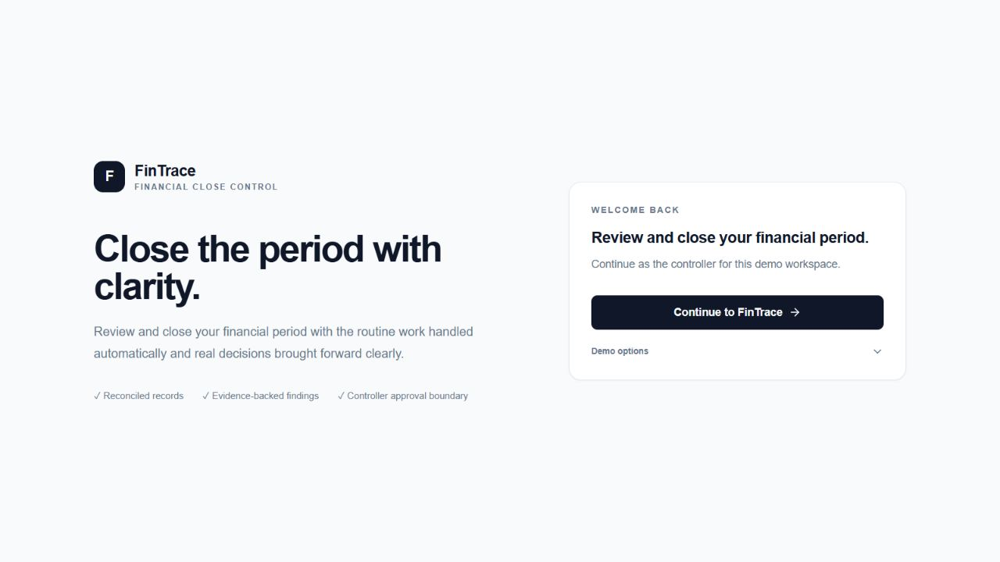 |
| 2 | Confirmed the home dashboard loaded the prepared August close and its status metrics. |  |
| 3 | Opened the new investigation form. | 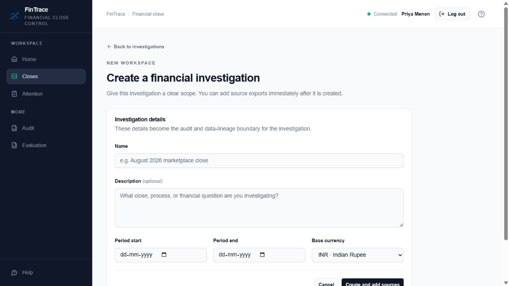 |
| 4 | Created the January E2E workspace and opened source intake. The browser automation bridge did not retain native date-input keystrokes, so the already-verified API create contract seeded this test workspace; the browser continued from the real source-intake route. | 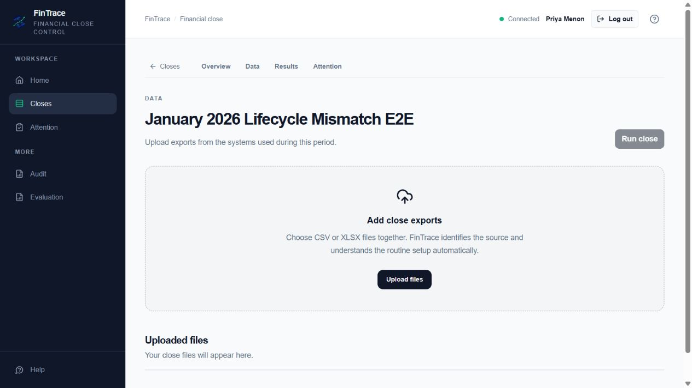 |
| 5 | Uploaded all seven January CSV/XLSX exports. All seven were understood and ready. | 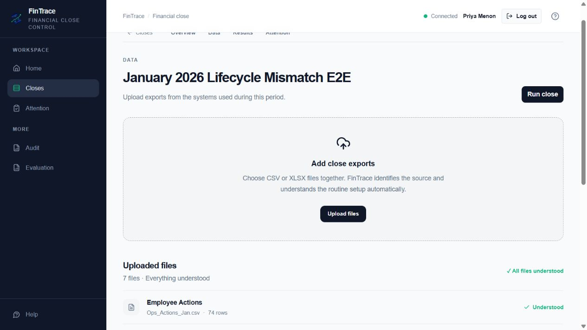 |
| 6 | Confirmed the rebuilt source workflow and organization-scoped ingestion safeguards. | 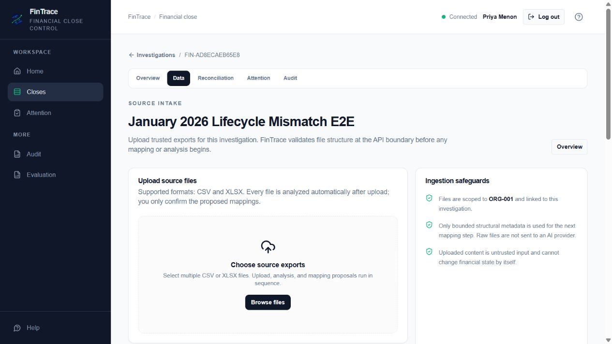 |
| 7 | Re-uploaded the successful POS export. FinTrace reported that it was already attached and created no duplicate. | 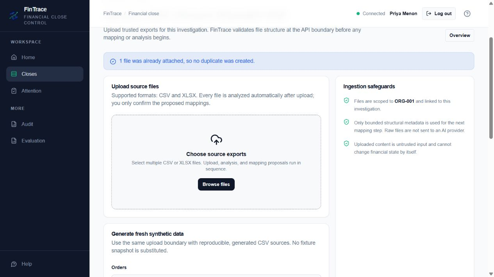 |
| 8 | Opened inventory mapping review. `UnitCost → unit_cost` and `InventoryValue → inventory_value` were present and confirmed. | 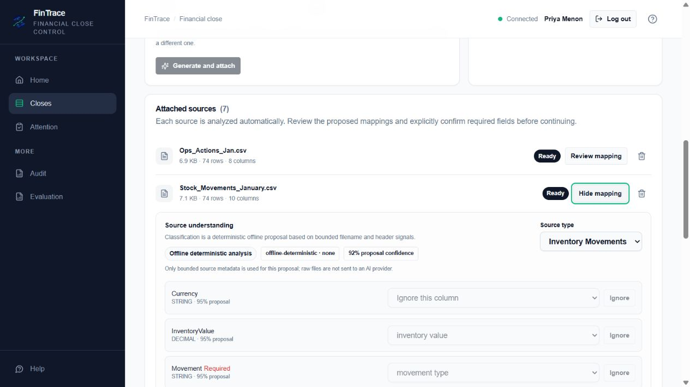 |
| 9 | Discovered relationships. Four high-confidence links were accepted automatically and eight conflicting/ambiguous links were left for review. | 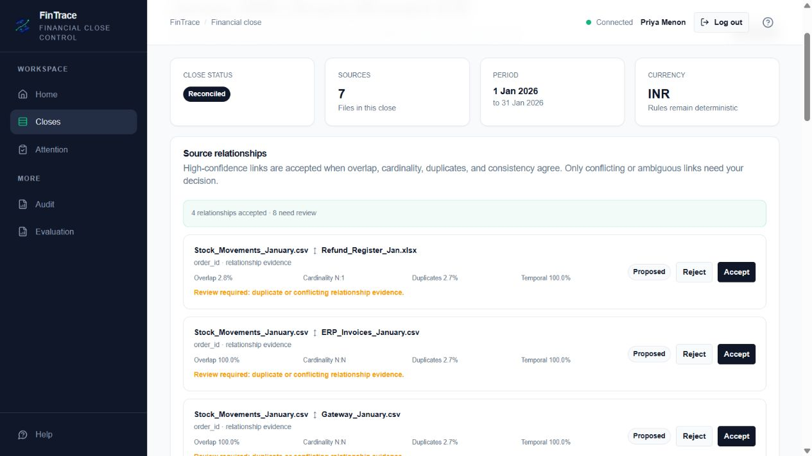 |
| 10 | Normalized the immutable dataset and ran deterministic reconciliation. | 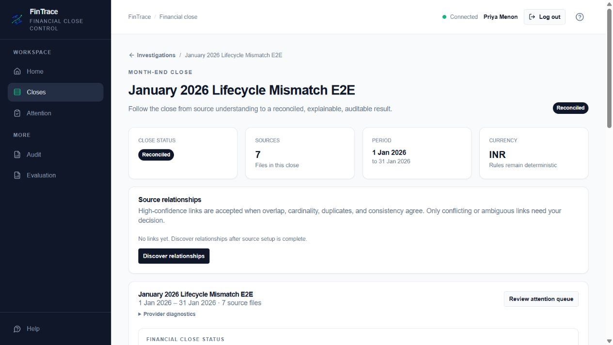 |
| 11 | Inspected the inventory mismatch. Sale and return movement evidence, SKU, quantity, unit cost, and inventory value were visible together. | 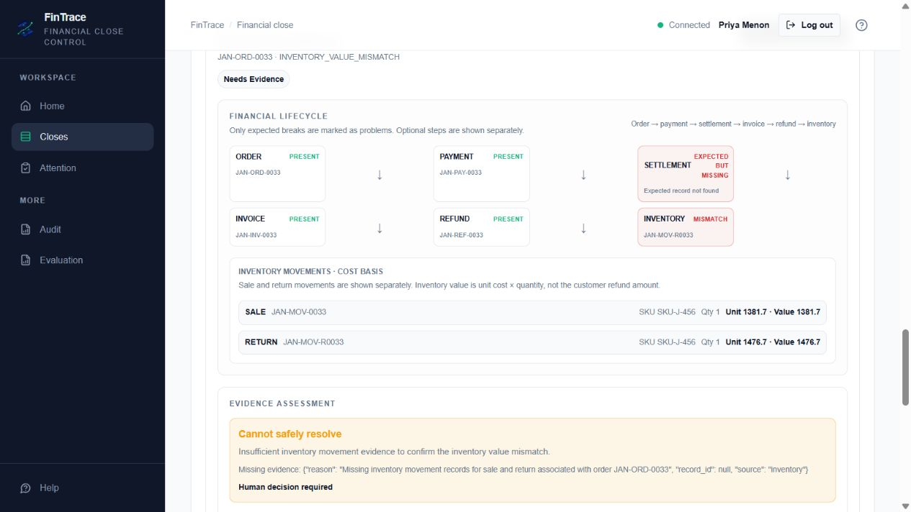 |
| 12 | Ran the live AI evidence check. The UI showed the actual provider/model. Groq returned `UNRESOLVED` because it did not request enough inventory evidence; the verifier passed the safe unresolved outcome and no unsupported root cause was shown. | 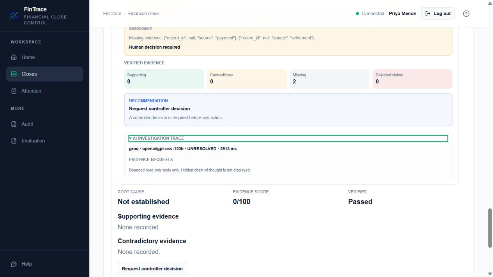 |
| 13 | Inspected the intentionally ambiguous payment case. Two payment candidates were shown and the case remained unresolved. | 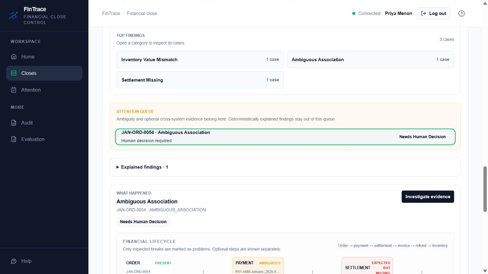 |
| 14 | Ran the AI check on the ambiguous case. It remained `NEEDS HUMAN DECISION` with missing payment/settlement evidence. | 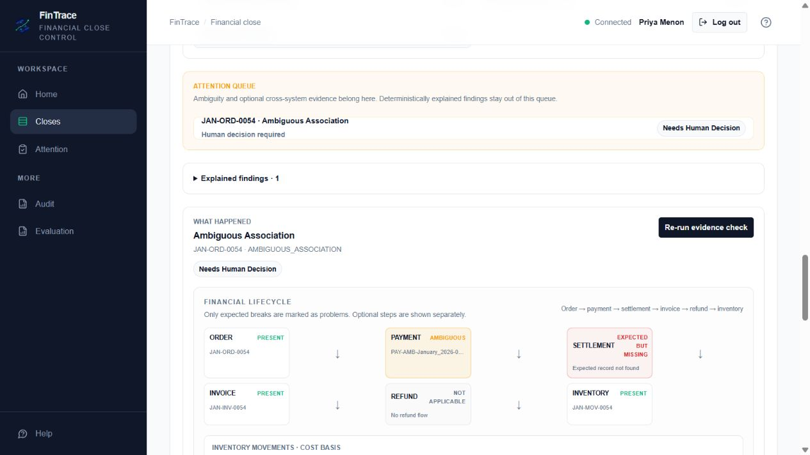 |
| 15 | Opened Attention. Only the ambiguous item appeared in the human queue; explained findings stayed out. |  |
| 16 | Opened Audit. Upload, analysis, mapping, reconciliation, deduplication, relationship, and AI investigation events were present. | 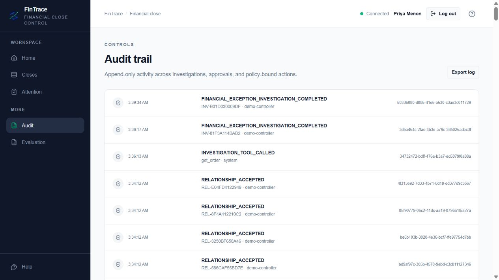 |

## Synthetic-data coverage

The generator validation confirmed exactly three intended anomalous lifecycles in every month:

| Month | Lifecycles | Records | Intended anomalies |
|---|---:|---:|---:|
| January | 72 | 440 | Inventory value, missing settlement, ambiguous payment |
| February | 76 | 458 | Duplicate payment, restored without refund, missing invoice + ambiguous payment |
| March | 80 | 514 | Refund without return, quantity mismatch, ERP reversal missing |
| April | 84 | 509 | Inventory calculation, settlement timing, ambiguous payment |
| May | 72 | 457 | Partial refund, inventory value, duplicate payment |
| June | 78 | 473 | Restored without refund, fee mismatch, data quality |
| July | 74 | 454 | Refund without return, missing settlement, ERP amount |
| August | 70 | 437 | Quantity mismatch, fee mismatch, ambiguous payment |

All ordinary lifecycles remained healthy in the generator ground-truth audit, and the generated inventory exports used varied unit-cost/value headers.

## Automated verification

- API tests from `apps/api`: `117 passed, 3 skipped`.
- Web typecheck: passed.
- Web production build: passed; all application routes generated.
- Web regression test: `1 passed`.
- `git diff --check`: passed; only line-ending normalization warnings were reported.
- Database migration `016_inventory_valuation.sql`: applied successfully.

## Notes

The initial browser create attempt showed HTTP 422 because the automation bridge left the native date controls blank. This was not another task modifying the project: the API accepted the same payload directly, and the form was hardened to read submitted DOM values as a fallback. The native date-entry limitation is recorded here so the E2E result is reproducible and not overstated.

The live provider is intentionally allowed to fail or remain unresolved. Deterministic reconciliation remains authoritative, and the UI keeps the actual provider metadata plus the verifier outcome visible.

## Fresh platform smoke retest

Date: 2026-09-05

A fresh browser pass repeated the key user journey: login → dashboard → closes → source intake → duplicate upload → inventory mapping → relationships → reconciliation → inventory evidence → AI trace → Attention → Audit.

The clean recheck passed with no hydration, application, or unhandled-runtime errors. The January workspace still showed `440 / 440` normalized records accounted for, `Inventory Value Mismatch`, `Ambiguous Association`, and `Settlement Missing`. Duplicate re-upload remained at `Attached sources (7)` and showed “already attached”; inventory mapping still showed `UnitCost → unit_cost` and `InventoryValue → inventory_value`.

The browser also verified separate `SALE` and `RETURN` inventory movements for `SKU-J-456`, including unit cost and inventory value, and confirmed that the ambiguous case displayed both competing payments and remained a human decision. Expanding the AI trace showed `groq · openai/gpt-oss-120b · UNRESOLVED` with `Verifier: Passed`, which is the expected safe result when the provider does not obtain enough evidence.

One transient API-unreachable fallback appeared during the first reconciliation navigation. After restarting the local API process and retrying the same route, it loaded correctly and the issue did not recur. This was recorded as an operational process blip, not a reconciliation or data-integrity failure.

Fresh browser evidence:

| Area | Screenshot |
|---|---|
| Login and dashboard |  · 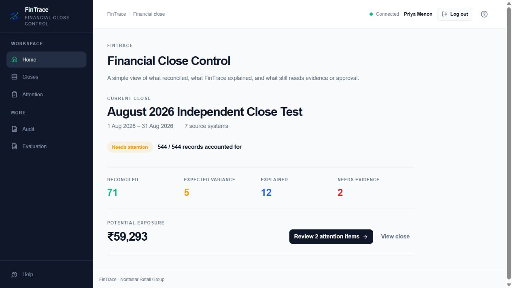 |
| Sources and deduplication |  ·  |
| Mapping and relationships | 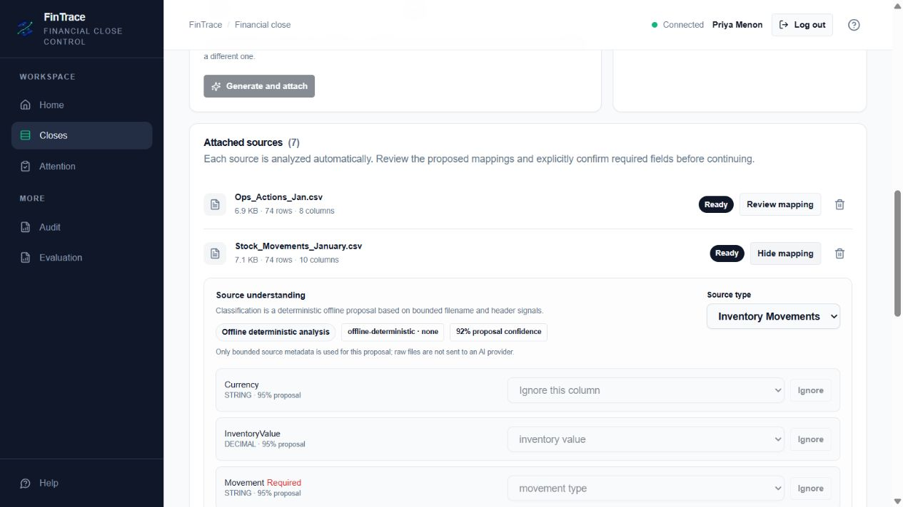 · 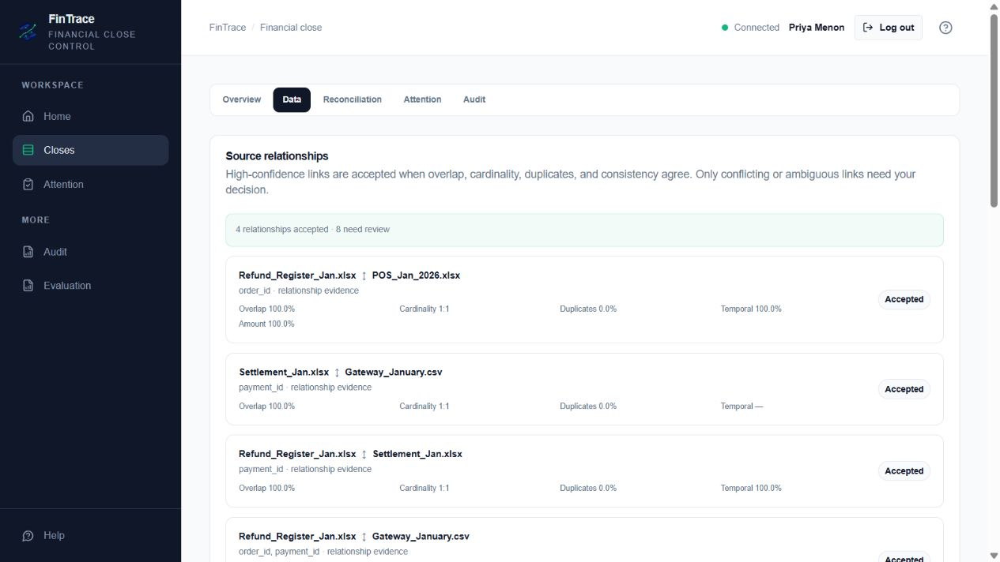 |
| Reconciliation and inventory evidence | 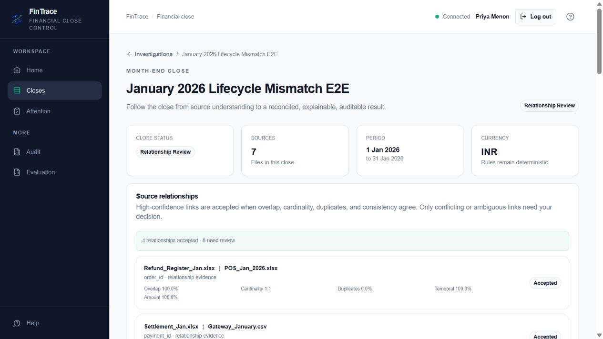 · 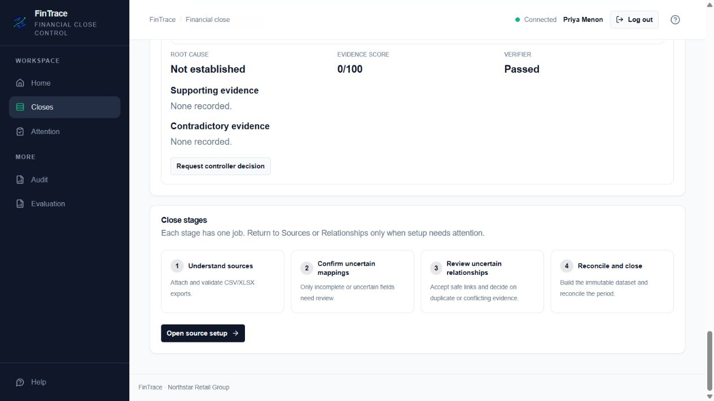 |
| AI, Attention, and Audit | 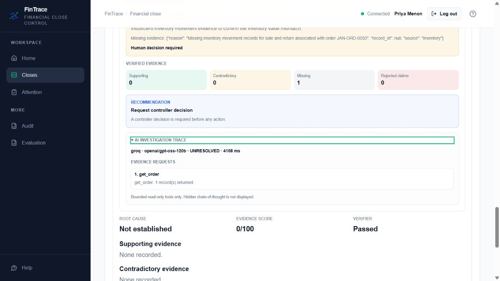 · 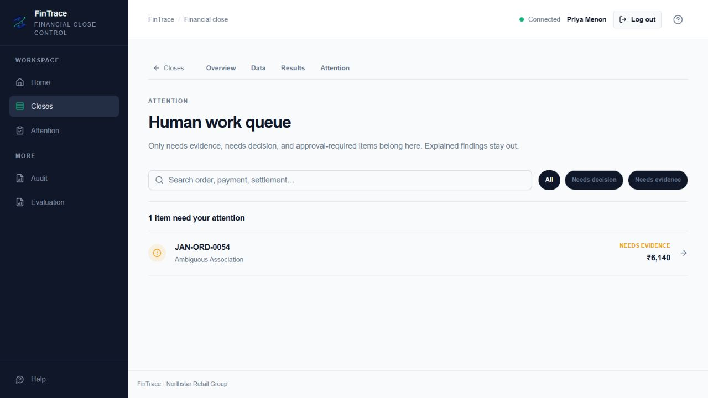 · 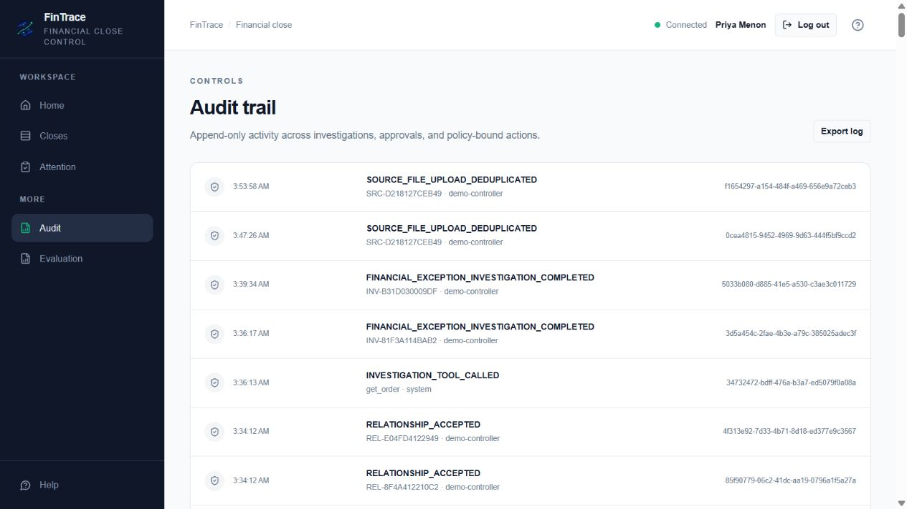 |

## Primary UX restoration

The primary investigation routes were restored to the original close workflow after review of the reference screenshots. The active path is again `Closes → Overview / Data / Results / Attention`; source intake shows `Uploaded files`, `Everything understood`, and `Understood` for automatically accepted sources. The richer lifecycle and provider work remains available through the API/domain implementation without replacing the controller-facing close UX.

| Restored surface | Screenshot |
|---|---|
| Automatic source intake | 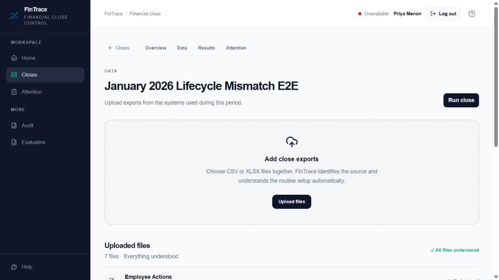 |
| Close results | 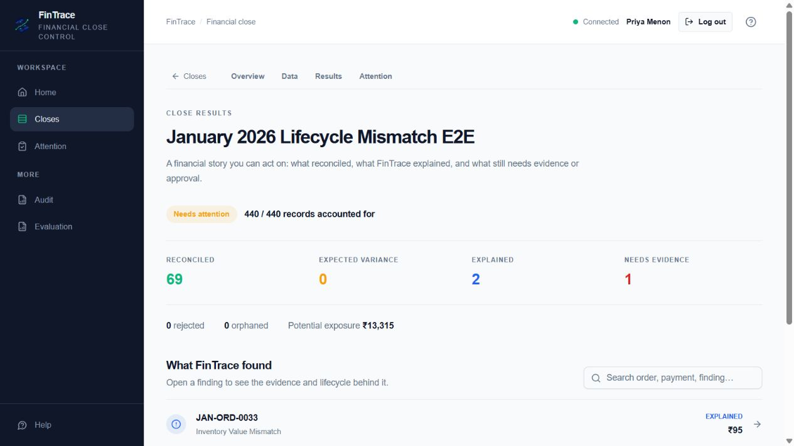 |
| Finding detail | 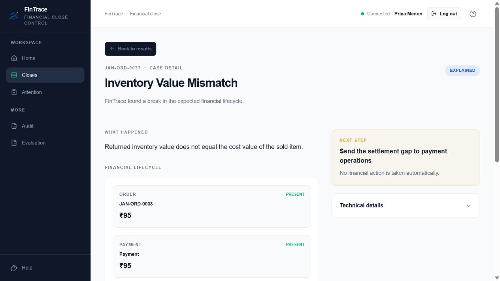 |

## Follow-up mapping correction

The browser review exposed a vendor-header coverage gap: `MoveID`, `OrderRef`, `ProductCode`, `Qty`, and `EventTime` were being shown as unmapped even though they unambiguously represent inventory movement fields. The deterministic alias catalog now maps these headers to `movement_id`, `order_id`, `sku`, `quantity`, and `occurred_at`; `Currency` is also recognized. Regression coverage was added, and the complete API suite remains green (`116 passed, 3 skipped`).

## February upload alias and classification correction

The February generated pack exposed a real deterministic source-analysis defect: valid vendor headers such as `PaymentRef`, `AmountPaid`, `PaidAt`, `BankCreditRef`, `FeeCharged`, `NetPaid`, `BillingNo`, and the branch-activity fields were not recognized by the offline alias catalog. The classifier also tied some files to the wrong source type because it did not give filename signals enough weight.

The alias catalog and filename classification rules were corrected, then the full seven-file February pack was uploaded into a fresh close through the API boundary and verified in the browser. All seven files were classified correctly, all required mappings were present, all seven confirmations returned `CONFIRMED`, and the controller-facing page showed `7 files · Everything understood`, `✓ All files understood`, and `7 sources connected successfully`.

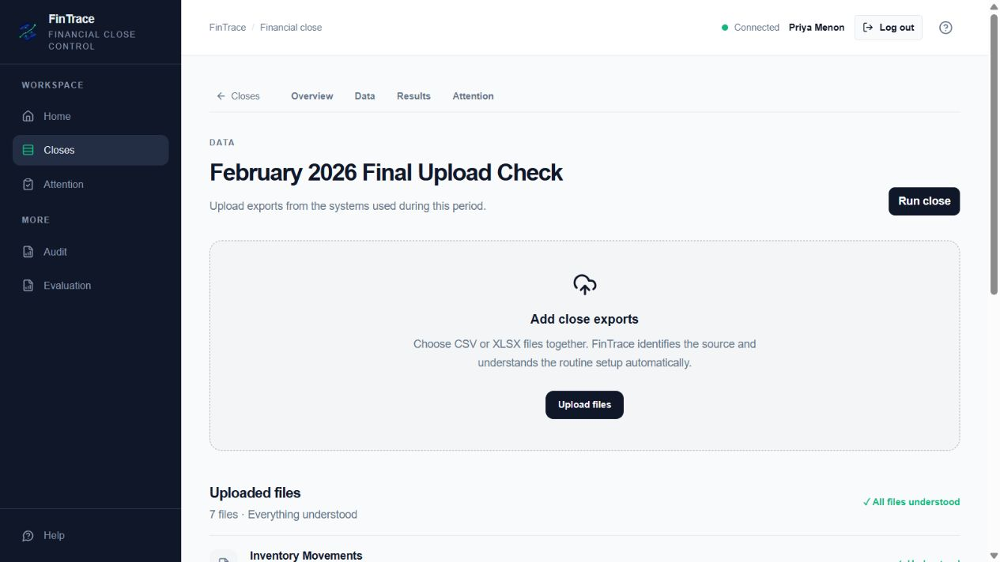

## February normalization and AI retest

The exact workspace from the reported error (`FIN-F209E875F9EB`) was retried after the date conversion fix without replacing its sources. All seven source files remained `READY`; normalization produced dataset version `DS-5B509BE95BDC` with `457` records from `7` sources. Reconciliation consumed `457 / 457` records with `0` rejected and `0` orphaned records, producing the intended three February findings: missing ERP invoice, inventory restored without refund, and duplicate payment.

A live Groq investigation was also run against the inventory-restoration finding. The provider used the normalized order and inventory records, cited the sale and return movements, and queried the absence of a refund. The verifier retained a safe `UNRESOLVED` outcome because the provider did not cite the required explicit missing-refund evidence; no unsupported AI conclusion was shown. This is the intended evidence boundary, not a normalization failure.

| Area | Screenshot |
|---|---|
| Corrected source intake | 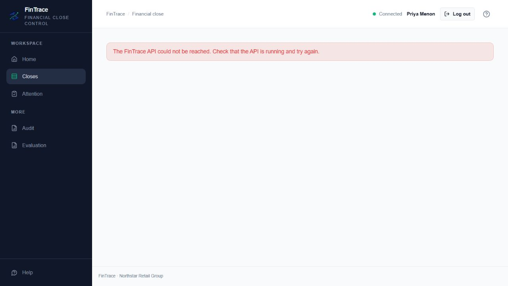 |
| Corrected reconciliation | 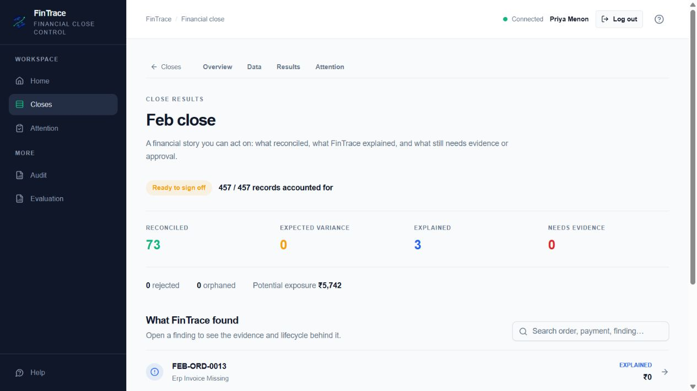 |

## February needs-evidence benchmark correction

Date: 2026-09-05

The reported February result had two defects: the fixture used a deterministic `MISSING_INVOICE` exception as the only third anomaly, so the close had no intentional `NEEDS EVIDENCE` lifecycle, and the reconciliation rule emitted that missing-invoice finding with `₹0` exposure. The engine now carries the completed order amount as potential exposure. The reusable generator now co-locates an ambiguous payment association with the missing-invoice lifecycle, preserving both scenarios without increasing the three-anomalous-lifecycle limit. The same ambiguity coverage is now present in every generated month while retaining the broader anomaly catalog.

The final generated February pack was uploaded into a new immutable close (`FIN-8A28642C60A7`) and verified through the browser:

- `7 files · Everything understood`; all required mappings accepted automatically.
- `458 / 458` records accounted for; `73` reconciled, `0` expected variance, `2` explained, and `1` needs evidence.
- `FEB-ORD-0013` is shown as `NEEDS EVIDENCE` with ₹3,150 exposure, not ₹0.
- The finding detail explains that two captured payments satisfy the available evidence, no unique reference safely identifies the valid payment, and additional settlement/reference evidence is required.
- The live investigation response was marked `Verifier: Passed` and reported `groq · openai/gpt-oss-120b` in Technical details. It remained safely unresolved instead of guessing which payment was valid.

| Area | Screenshot |
|---|---|
| Final source intake | 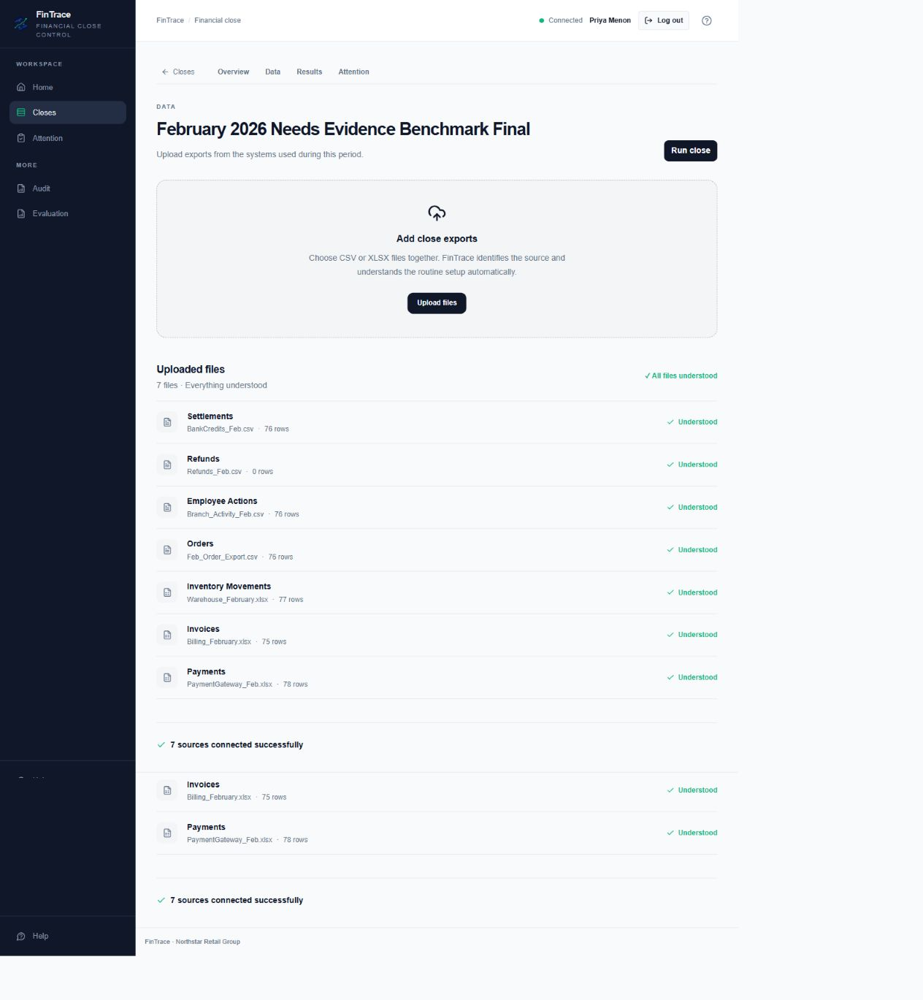 |
| Final results | 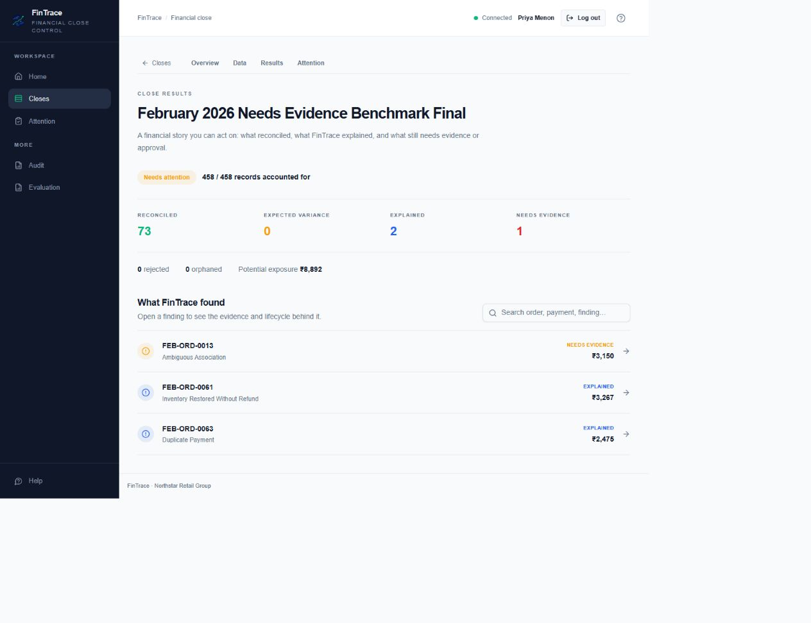 |
| Final Groq investigation | 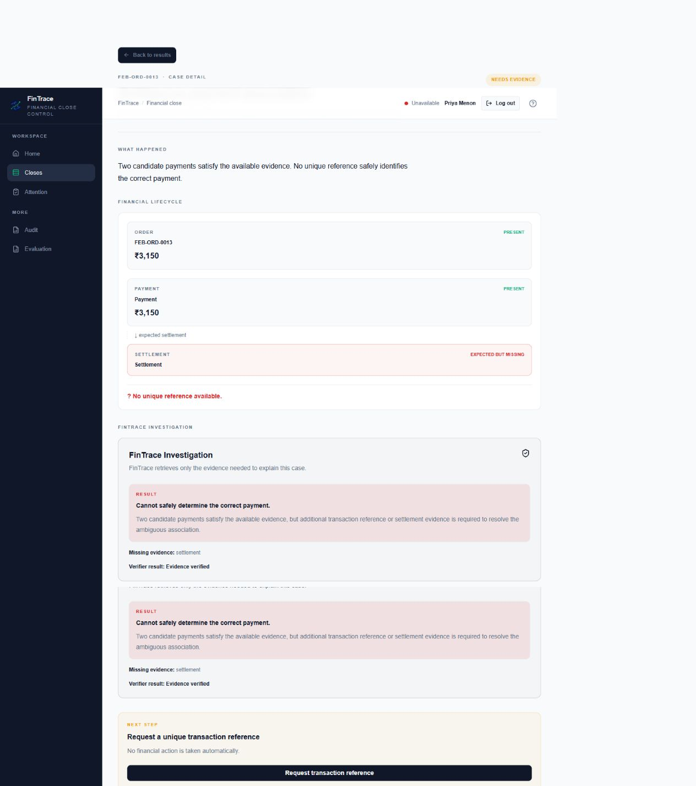 |
